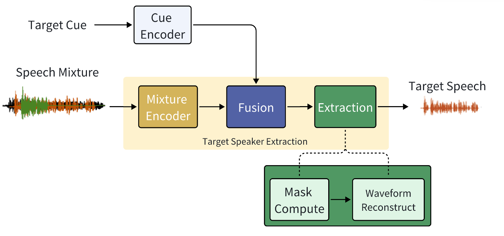
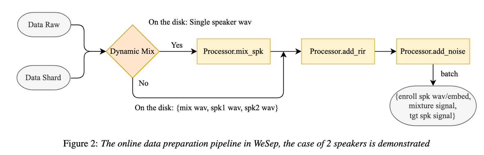

# Wesep

> We aim to build a toolkit focusing on front-end processing in the cocktail party set up, including target speaker extraction and ~~speech separation (Future work)~~


### Install for development & deployment
* Clone this repo
``` sh
https://github.com/wenet-e2e/wesep.git
```

* Create conda env: pytorch version >= 1.12.0 is required !!!
``` sh
conda create -n wesep python=3.9
conda activate wesep
conda install pytorch=1.12.1 torchaudio=0.12.1 cudatoolkit=11.3 -c pytorch -c conda-forge
pip install -r requirements.txt
pre-commit install  # for clean and tidy code
```

## The Target Speaker Extraction Task

> Target speaker extraction (TSE) focuses on isolating the speech of a specific target speaker from overlapped multi-talker speech, which is a typical setup in the cocktail party problem.
WeSep is featured with flexible target speaker modeling, scalable data management, effective on-the-fly data simulation, structured recipes and deployment support.



## Features (To Do List)

- [x] On the fly data simulation
  - [x] Dynamic Mixture simulation
  - [x] Dynamic Reverb simulation
  - [x] Dynamic Noise simulation
- [x] Support time- and frequency- domain models
    - Time-domain
        - [x] conv-tasnet based models
            - [x] Spex+
    - Frequency domain
        - [x] pBSRNN
        - [x] pDPCCN
        - [x] tf-gridnet (Extremely slow, need double check)
- [ ] Training Criteria
    - [x] SISNR loss
    - [x] GAN loss  (Need further investigation)
- [ ] Datasets
  - [x] Libri2Mix (Illustration for pre-mixed speech)
  - [x] VoxCeleb (Illustration for online training)
  - [ ] WSJ0-2Mix
- [ ] Speaker Embedding
  - [x] Wespeaker Intergration
  - [x] Joint Learned Speaker Embedding
  - [x] Different fusion methods
- [ ] Pretrained models
- [ ] CLI Usage
- [x] Runtime

## Data Pipe Design

Following Wenet and WesSeaker, WeSep organizes the data processing modules as a pipeline of a set of different processors. The following figure shows such a pipeline with essential processors.



## Discussion

For Chinese users, you can scan the QR code on the left to join our group directly. If it has expired, please scan the personal Wechat QR code on the right. 


## Citations
If you find wespeaker useful, please cite it as

```bibtex
@inproceedings{wang24fa_interspeech,
  title     = {WeSep: A Scalable and Flexible Toolkit Towards Generalizable Target Speaker Extraction},
  author    = {Shuai Wang and Ke Zhang and Shaoxiong Lin and Junjie Li and Xuefei Wang and Meng Ge and Jianwei Yu and Yanmin Qian and Haizhou Li},
  year      = {2024},
  booktitle = {Interspeech 2024},
  pages     = {4273--4277},
  doi       = {10.21437/Interspeech.2024-1840},
}
```
