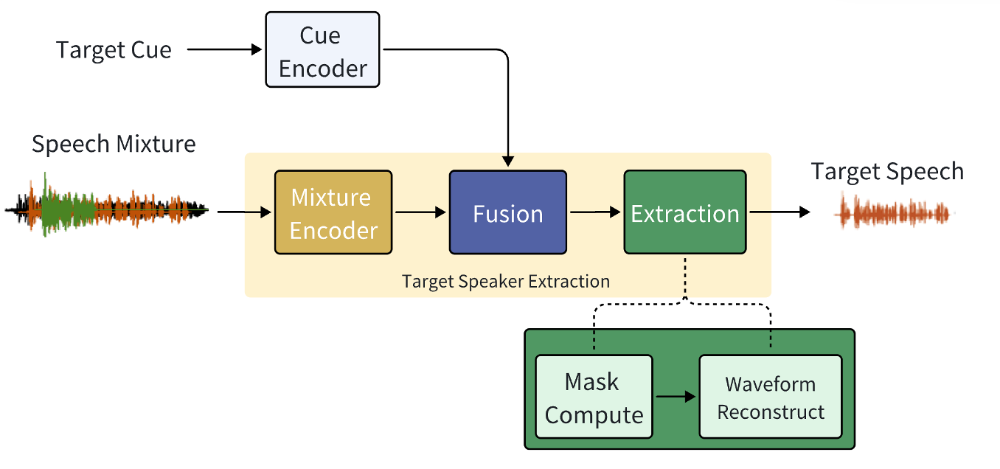
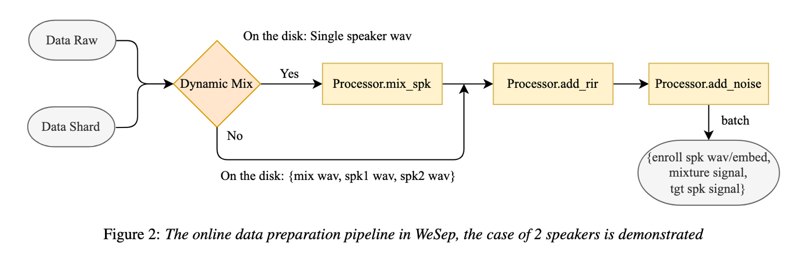

# Wesep

> We aim to build a toolkit focusing on front-end processing in the cocktail party set up, including target speaker extraction and ~~speech separation (Future work)~~


### Install for development & deployment
* Clone this repo
``` sh
https://github.com/wenet-e2e/wesep.git
```

* Create conda env: pytorch version >= 1.12.0 is required !!!
``` sh
git clone git@github.com:wenet-e2e/wesep.git
conda create -n wesep python==3.10.16 -y
conda activate wesep
cd ..
git@github.com:wenet-e2e/wespeaker.git
cd -
cp -r ../wespeaker/wespeaker .
pip install numpy==1.26.4
pip install torch==2.1.0 torchvision==0.16.0 torchaudio==2.1.0 --index-url https://download.pytorch.org/whl/cu121
pip install transformers==4.49.0
pip install fire==0.7.0
pip install matplotlib==3.7.5
pip install tableprint==0.9.1
pip install thop==0.1.1.post2209072238
pip install silero-vad==5.1.2 soundfile==0.12.1
pip install kaldiio==2.18.1
pip install s3prl==0.4.18
pip install -U openai-whisper
pip install peft==0.14.0
pip install scipy==1.11.4
pip install espnet==202402 # numpy变成1.23.5
pip install umap-learn==0.5.5 hdbscan==0.8.33
pip install setuptools==65.7.0 # setuptools-83.0.0 降级为 65.7.0
pip install lmdb==1.3.0
pip install auraloss==0.4.0
pip install torchmetrics==1.3.2
```

## The Target Speaker Extraction Task

> Target speaker extraction (TSE) focuses on isolating the speech of a specific target speaker from overlapped multi-talker speech, which is a typical setup in the cocktail party problem.
WeSep is featured with flexible target speaker modeling, scalable data management, effective on-the-fly data simulation, structured recipes and deployment support.



## Features (To Do List)

- [x] On the fly data simulation
  - [x] Dynamic Mixture simulation
  - [x] Dynamic Reverb simulation
  - [x] Dynamic Noise simulation
- [x] Support time- and frequency- domain models
    - Time-domain
        - [x] conv-tasnet based models
            - [x] Spex+
    - Frequency domain
        - [x] pBSRNN
        - [x] pDPCCN
        - [x] tf-gridnet (Extremely slow, need double check)
- [ ] Training Criteria
    - [x] SISNR loss
    - [x] GAN loss  (Need further investigation)
- [ ] Datasets
  - [x] Libri2Mix (Illustration for pre-mixed speech)
  - [x] VoxCeleb (Illustration for online training)
  - [ ] WSJ0-2Mix
- [ ] Speaker Embedding
  - [x] Wespeaker Intergration
  - [x] Joint Learned Speaker Embedding
  - [x] Different fusion methods
- [ ] Pretrained models
- [ ] CLI Usage
- [x] Runtime

## Data Pipe Design

Following Wenet and Wespeaker, WeSep organizes the data processing modules as a pipeline of a set of different processors. The following figure shows such a pipeline with essential processors.



## Discussion

For Chinese users, you can scan the QR code on the left to join our group directly. If it has expired, please scan the personal Wechat QR code on the right.

|||
| ---- | ---- |


## Citations
If you find wespeaker useful, please cite it as

```bibtex
@inproceedings{wang24fa_interspeech,
  title     = {WeSep: A Scalable and Flexible Toolkit Towards Generalizable Target Speaker Extraction},
  author    = {Shuai Wang and Ke Zhang and Shaoxiong Lin and Junjie Li and Xuefei Wang and Meng Ge and Jianwei Yu and Yanmin Qian and Haizhou Li},
  year      = {2024},
  booktitle = {Interspeech 2024},
  pages     = {4273--4277},
  doi       = {10.21437/Interspeech.2024-1840},
}
```
